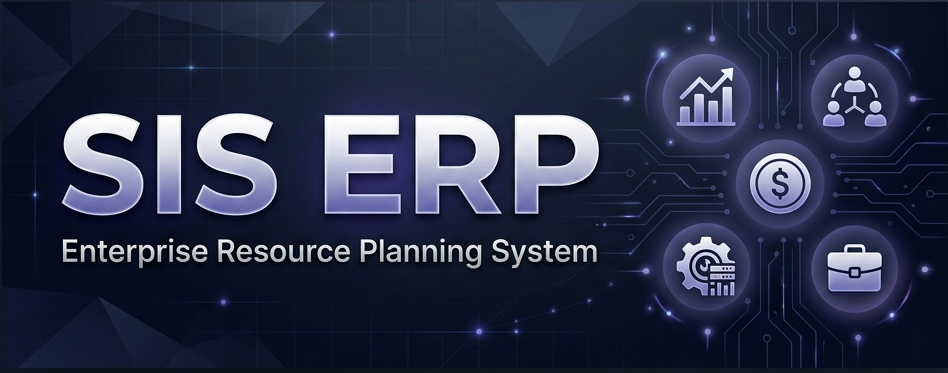

<div align="center">


A comprehensive, modular ERP platform designed for mid-to-large scale business operations — covering Sales, HR, Finance, Inventory, Project Management, CMS, and more.


</div>

---

## Table of Contents

- [Overview](#overview)
- [Architecture](#architecture)
- [Modules](#modules)
- [Tech Stack](#tech-stack)
- [Getting Started](#getting-started)
- [Project Structure](#project-structure)
- [Authentication & Authorization](#authentication--authorization)
- [Environment Variables](#environment-variables)
- [Scripts](#scripts)
- [API Reference](#api-reference)
- [Contributing](#contributing)

---

## Overview

SIS ERP is a **single-platform business management system** that unifies the operational backbone of an organization into one cohesive application. Instead of relying on fragmented third-party tools for CRM, HR, Finance, and Project Management, SIS consolidates everything under a single authentication layer, a shared data model, and a consistent UI.

**Who is it for?**
- IT services and consulting companies
- Software houses managing clients, projects, and employees
- Any organization that needs a centralized operational control center

---

## Architecture

```
┌──────────────────────────────────────────────────────────┐
│                     Client (Browser)                     │
│               Next.js App Router + React 19              │
├──────────────────────────────────────────────────────────┤
│                    Middleware Layer                       │
│         Authentication Guard + Route Protection          │
├──────────────────────────────────────────────────────────┤
│                     API Layer                            │
│   /api/* Routes → RBAC Check → Service Logic → Response  │
├──────────────────────────────────────────────────────────┤
│                   Data Layer                             │
│          Mongoose ODM → MongoDB Atlas Cluster            │
├──────────────────────────────────────────────────────────┤
│                External Services                         │
│              SMTP (Nodemailer) · PDF Export               │
└──────────────────────────────────────────────────────────┘
```

**Key Architectural Decisions:**

| Decision | Rationale |
|---|---|
| **Feature-based file structure** | Each module owns its models, components, and forms. No cross-module coupling. |
| **Centralized permissions registry** | Single `permissions.ts` file drives RBAC across middleware, API guards, sidebar navigation, and UI gates. |
| **Config-driven navigation** | The sidebar, breadcrumbs, and module registry are all driven by `navigation.ts` and `modules.ts` — zero hardcoded links in components. |
| **Server-side API routes** | All data mutations go through Next.js API routes with Mongoose, never from client-side directly. |

---

## Modules

| Module | Routes | Description |
|---|---|---|
| **Dashboard** | `/admin` | Real-time KPIs, financial charts, pipeline funnels, and global `Cmd+K` search |
| **CRM** | `/admin/crm/*` | Leads, Customers, Contacts, Opportunities (Kanban Pipeline), Quotations, Follow-ups |
| **Project Management** | `/admin/projects/*` | Projects, Task Kanban Boards (drag-and-drop), Time Tracking |
| **HR & Payroll** | `/admin/hr/*` | Attendance (punch in/out), Leave Management, Payroll |
| **Finance** | `/admin/finance/*` | Invoices (PDF export), Payments, Expenses with category tracking |
| **Inventory** | `/admin/products/*` | Product Catalog, Categories, Stock Levels with low-stock alerts |
| **Services & Support** | `/admin/services/*` | Helpdesk Tickets, Knowledge Base |
| **CMS** | `/admin/cms/*` | Blogs, FAQs, Testimonials, Contact Inbox |
| **Reports & Analytics** | `/admin/reports/*` | Business Analytics, Revenue Reports, Lead Funnels, Workforce Distribution |
| **Administration** | `/admin/users`, `/admin/roles`, etc. | Users, Roles & Permissions, Employees, Departments, Branches, Company Settings, Activity Logs, Notifications, File Manager |

---

## Tech Stack

### Core

| Technology | Purpose |
|---|---|
| **Next.js 16** (App Router) | Full-stack React framework — SSR, API routes, middleware |
| **React 19** | UI rendering with server and client components |
| **TypeScript 5** | Type safety across the full stack |
| **MongoDB** + **Mongoose 9** | Document database with schema validation and population |
| **Tailwind CSS 4** | Utility-first styling |

### Libraries

| Library | Purpose |
|---|---|
| `next-auth` (v5 beta) | Session-based authentication |
| `react-hook-form` + `zod` | Form state management + schema validation |
| `recharts` | Interactive charts and data visualization |
| `lucide-react` | Consistent icon set |
| `nodemailer` | SMTP email delivery (password reset, notifications) |
| `html2pdf.js` | Client-side PDF generation for invoices |
| `zustand` | Lightweight global state (notifications, toasts) |
| `bcryptjs` | Password hashing |
| `date-fns` | Date formatting and manipulation |

---

## Getting Started

### Prerequisites

- **Node.js** ≥ 18
- **MongoDB** instance (local or [MongoDB Atlas](https://www.mongodb.com/cloud/atlas))
- **Gmail App Password** or any SMTP credentials (for email functionality)

### Installation

```bash
# 1. Clone the repository
git clone https://github.com/ermradulsharma/sis.git
cd sis

# 2. Install dependencies
npm install

# 3. Configure environment variables
cp .env.example .env.local
# Edit .env.local with your values (see Environment Variables section)

# 4. Seed the database with default admin user and roles
npx tsx scripts/seed.ts

# 5. Start the development server
npm run dev
```

Open [http://localhost:3000](http://localhost:3000) in your browser.

### Default Login Credentials

After running the seed script:

| Field | Value |
|---|---|
| **Email** | `admin@sis-erp.com` |
| **Password** | `password123` |

> ⚠️ **Change the default password immediately after first login.**

---

## Project Structure

```
src/
├── app/
│   ├── (auth)/                  # Public auth pages (login, forgot-password, reset-password)
│   ├── admin/                   # Protected dashboard pages (all ERP modules)
│   │   ├── crm/                 # CRM pages (leads, customers, pipeline, etc.)
│   │   ├── finance/             # Finance pages (invoices, payments, expenses)
│   │   ├── hr/                  # HR pages (attendance, leave, payroll)
│   │   ├── projects/            # Project management pages
│   │   ├── products/            # Inventory pages
│   │   ├── services/            # Support tickets & knowledge base
│   │   ├── cms/                 # CMS pages (blogs, FAQs, testimonials)
│   │   ├── reports/             # Analytics & reports
│   │   └── ...                  # Users, roles, settings, etc.
│   └── api/                     # REST API routes (server-side only)
│
├── components/
│   ├── data/                    # DataTable, StatCard, ChartCard, ActivityFeed
│   ├── forms/                   # FormField, FormSelect, FileUpload
│   ├── layout/                  # Sidebar, Header, BreadcrumbNav, ContentArea
│   ├── providers/               # React context providers (auth, theme)
│   └── ui/                      # Button, Input, Modal, Badge, Toast, Pagination, etc.
│
├── config/
│   ├── modules.ts               # Module registry with base paths
│   ├── navigation.ts            # Sidebar navigation tree (config-driven)
│   └── permissions.ts           # Central RBAC permission definitions
│
├── features/                    # Feature modules (domain-driven)
│   ├── auth/                    # Login, ForgotPassword, ResetPassword components
│   ├── crm/                     # CRM models + form components
│   ├── finance/                 # Invoice, Payment, Expense models + forms
│   ├── hr/                      # Attendance, Leave, Payroll models + forms
│   ├── projects/                # Project, Task models + forms
│   ├── products/                # Product, Category models + forms
│   ├── services/                # Ticket, Knowledge Base models + forms
│   ├── cms/                     # Blog, FAQ, Testimonial, Contact models
│   ├── users/                   # User model
│   ├── roles/                   # Role model
│   └── ...                      # departments, branches, notifications, etc.
│
├── hooks/                       # Custom React hooks (usePagination, useMediaQuery)
├── lib/                         # Shared utilities (auth, db, mail, csv, pdf, notifications)
├── services/                    # API service layer (centralized HTTP client)
├── stores/                      # Zustand stores (notification toasts)
├── types/                       # TypeScript type definitions
└── middleware.ts                # Auth guard + route protection
```

---

## Authentication & Authorization

### Authentication Flow
1. User submits credentials → `next-auth` validates against MongoDB
2. JWT session token issued → stored as HTTP-only cookie
3. `middleware.ts` intercepts every request → redirects unauthenticated users to `/login`
4. Public routes (`/login`, `/forgot-password`, `/reset-password`) bypass the guard

### Password Reset Flow
1. User enters email on `/forgot-password`
2. API generates a SHA-256 hashed token, stores it with 1-hour expiry
3. Real email sent via SMTP (Nodemailer) with reset link
4. User clicks link → `/reset-password?token=XYZ`
5. API verifies token, hashes new password with bcrypt, clears token

### RBAC (Role-Based Access Control)

Permissions follow the format: `module:resource:action`

```
crm:leads:read        # Can view leads
finance:invoices:*    # Full CRUD on invoices
*:*:*                 # Super admin (unrestricted)
```

**Default Roles:**

| Role | Access Level |
|---|---|
| `super-admin` | Unrestricted — all modules, all actions |
| `admin` | Full access to all business modules |
| `manager` | CRM + Projects + read access to employees/departments |
| `employee` | Own tasks, time tracking, attendance, leave requests |
| `viewer` | Read-only across all modules |

---

## Environment Variables

Create a `.env.local` file in the project root:

```env
# Database
MONGODB_URI=mongodb+srv://<user>:<password>@cluster.mongodb.net/<db_name>

# Authentication
AUTH_SECRET=<random-32-char-string>
AUTH_URL=http://localhost:3000

# Application
NEXT_PUBLIC_APP_NAME=SIS ERP
NEXT_PUBLIC_APP_URL=http://localhost:3000

# SMTP Email (required for password reset)
MAIL_MAILER=smtp
SMTP_HOST=smtp.gmail.com
SMTP_PORT=587
SMTP_USER=your_email@gmail.com
SMTP_PASS=your_app_password
```

> **Note:** For Gmail, use an [App Password](https://support.google.com/accounts/answer/185833), not your regular password.

---

## Scripts

| Command | Description |
|---|---|
| `npm run dev` | Start development server (Turbopack) |
| `npm run build` | Create production build |
| `npm run start` | Start production server |
| `npm run lint` | Run ESLint |
| `npx tsx scripts/seed.ts` | Seed database with default admin user, role, and company settings |

---

## API Reference

All API routes are located under `/api/` and follow REST conventions.

### Auth
| Method | Endpoint | Description |
|---|---|---|
| `POST` | `/api/auth/forgot-password` | Send password reset email |
| `POST` | `/api/auth/reset-password` | Reset password with token |

### Core Resources
| Method | Endpoint | Description |
|---|---|---|
| `GET/POST` | `/api/users` | List / Create users |
| `GET/POST` | `/api/roles` | List / Create roles |
| `GET/POST` | `/api/employees` | List / Create employees |
| `GET/POST` | `/api/departments` | List / Create departments |
| `GET/POST` | `/api/branches` | List / Create branches |
| `GET` | `/api/activity-logs` | List activity logs |
| `GET/POST` | `/api/notifications` | List / Create notifications |
| `GET` | `/api/notifications/unread` | Get unread notification count |
| `GET/POST` | `/api/files` | List / Upload files |
| `GET/PUT` | `/api/settings/company` | Get / Update company settings |

### CRM
| Method | Endpoint | Description |
|---|---|---|
| `GET/POST` | `/api/crm/leads` | List / Create leads |
| `GET/PATCH` | `/api/crm/leads/[id]` | Get / Update lead |
| `GET/POST` | `/api/crm/customers` | List / Create customers |
| `GET/PATCH` | `/api/crm/customers/[id]` | Get / Update customer |
| `GET/POST` | `/api/crm/contacts` | List / Create contacts |
| `GET/POST` | `/api/crm/opportunities` | List / Create opportunities |
| `PATCH` | `/api/crm/opportunities/[id]` | Update opportunity (pipeline stage) |
| `GET/POST` | `/api/crm/quotations` | List / Create quotations |
| `GET/POST` | `/api/crm/follow-ups` | List / Create follow-ups |

### Projects
| Method | Endpoint | Description |
|---|---|---|
| `GET/POST` | `/api/projects` | List / Create projects |
| `GET/PATCH` | `/api/projects/[id]` | Get / Update project |
| `GET/POST` | `/api/tasks` | List / Create tasks |
| `PATCH` | `/api/tasks/[id]` | Update task (Kanban drag-drop) |

### HR
| Method | Endpoint | Description |
|---|---|---|
| `GET/POST` | `/api/hr/attendance` | List / Clock in-out |
| `GET/POST` | `/api/hr/leave` | List / Submit leave requests |
| `GET/POST` | `/api/hr/payroll` | List / Create payroll records |

### Finance
| Method | Endpoint | Description |
|---|---|---|
| `GET/POST` | `/api/finance/invoices` | List / Create invoices |
| `GET/POST` | `/api/finance/payments` | List / Record payments |
| `GET/POST` | `/api/finance/expenses` | List / Record expenses |

### Products & Inventory
| Method | Endpoint | Description |
|---|---|---|
| `GET/POST` | `/api/products` | List / Create products |
| `GET/POST` | `/api/products/categories` | List / Create categories |

### Services
| Method | Endpoint | Description |
|---|---|---|
| `GET/POST` | `/api/services/tickets` | List / Create support tickets |
| `GET/POST` | `/api/services/knowledge-base` | List / Create KB articles |

### CMS
| Method | Endpoint | Description |
|---|---|---|
| `GET/POST` | `/api/cms/blogs` | List / Create blog posts |
| `GET/POST` | `/api/cms/faqs` | List / Create FAQs |
| `GET/POST` | `/api/cms/testimonials` | List / Create testimonials |
| `GET/POST` | `/api/cms/contacts` | List / Create contact messages |

### Dashboard & Reports
| Method | Endpoint | Description |
|---|---|---|
| `GET` | `/api/dashboard/metrics` | Aggregated dashboard KPIs |
| `GET` | `/api/reports/business` | Business analytics data |
| `GET` | `/api/reports/revenue` | Revenue & financial reports |
| `GET` | `/api/search` | Global cross-module search |

---

## Contributing

1. Fork the repository
2. Create a feature branch (`git checkout -b feature/your-feature`)
3. Commit your changes (`git commit -m 'Add your feature'`)
4. Push to the branch (`git push origin feature/your-feature`)
5. Open a Pull Request

---

<div align="center">

**Built with ❤️ for SIS Operations**

</div>
