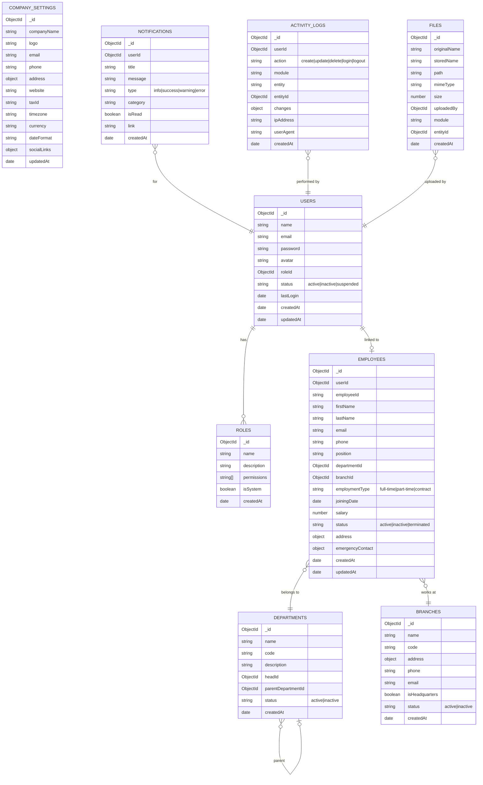
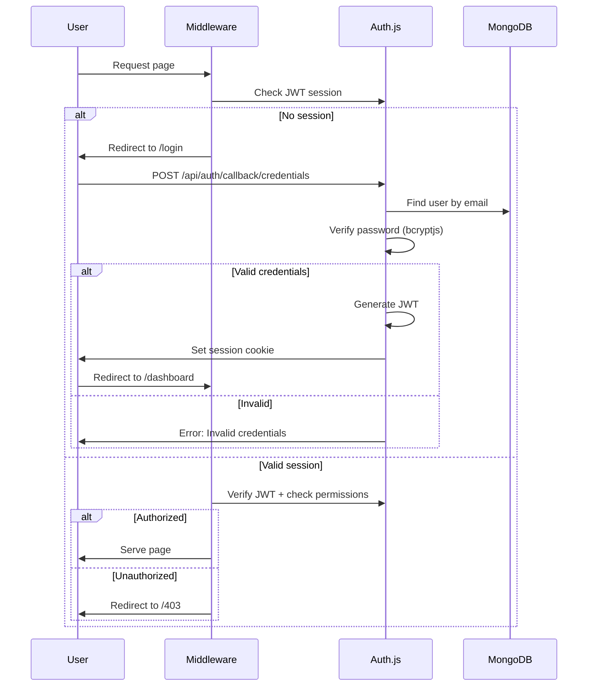

# Modular ERP for Software Company — Implementation Plan

## Overview

Build an enterprise-grade, modular ERP platform for a software development company using **Next.js 16** (App Router), **MongoDB + Mongoose**, **Auth.js v5**, **Tailwind CSS v4**, and **Zustand**. The system manages internal operations across 9 major domains from a single, centralized dashboard.

## Tech Stack

| Layer | Technology | Rationale |
|---|---|---|
| Framework | Next.js 16 (App Router, Turbopack) | Current LTS, RSC, streaming, `use cache` |
| Database | MongoDB + Mongoose | Flexible schema for ERP entities, user choice |
| Auth | Auth.js v5 (Credentials + OAuth) | JWT sessions, MongoDB adapter, RBAC |
| Styling | Tailwind CSS v4 | Default with Next.js 16, rapid development |
| State | Zustand (client) + RSC (server) | Lightweight, minimal boilerplate |
| Forms | React Hook Form + Zod | Performant validation with type inference |
| Charts | Recharts | Lightweight, composable, RSC-friendly |
| Icons | Lucide React | Tree-shakeable, consistent icon set |
| HTTP | Native `fetch` + custom service layer | No extra dependencies |

---

## Phased Approach

> [!IMPORTANT]
> Given the massive scope (9 modules, 50+ sub-modules), we implement in phases. Each phase delivers a fully functional vertical slice.

| Phase | Scope | Deliverables |
|---|---|---|
| **Phase 1** (Current) | Architecture + Core + Dashboard | Full project setup, auth, RBAC, users, employees, departments, branches, company settings, notifications, activity logs, file manager, dashboard with KPIs/charts |
| Phase 2 | CRM | Leads, customers, contacts, pipeline, opportunities, quotations, follow-ups |
| Phase 3 | Project Management | Projects, milestones, tasks, sprints, kanban, time tracking, reports |
| Phase 4 | Product & Service Mgmt | Products, versions, licensing, support tickets, SLA, knowledge base |
| Phase 5 | HRMS | Attendance, leave, payroll, holidays, performance reviews |
| Phase 6 | Finance | Invoices, expenses, payments, revenue, financial reports |
| Phase 7 | CMS | Pages, blogs, media, FAQs, testimonials, careers, contact messages |
| Phase 8 | Reports & Analytics | Business analytics, revenue/employee/project/client reports |

---

## Architecture

### Layered Architecture

```
┌─────────────────────────────────────────────────┐
│                 Presentation Layer               │
│  (Pages, Layouts, UI Components, Client State)   │
├─────────────────────────────────────────────────┤
│                 Application Layer                │
│  (Server Actions, Route Handlers, Middleware)    │
├─────────────────────────────────────────────────┤
│                 Business/Service Layer            │
│  (Domain Services, Validation, Business Rules)   │
├─────────────────────────────────────────────────┤
│                 Data Access Layer                 │
│  (Repositories, Mongoose Models, DB Connection)  │
├─────────────────────────────────────────────────┤
│                 Infrastructure Layer              │
│  (Auth, Logging, File Storage, Email, Config)    │
└─────────────────────────────────────────────────┘
```

### Feature-Based Module Architecture

Each module is self-contained with its own components, services, models, and types:

```
src/features/<module>/
├── components/       # Module-specific UI components
├── services/         # Business logic and data operations
├── models/           # Mongoose schemas and models
├── types/            # TypeScript interfaces and types
├── hooks/            # Module-specific React hooks
├── actions/          # Server Actions
├── constants/        # Module constants and config
└── utils/            # Module-specific utilities
```

---

## Folder Structure

```
d:\github\sis\
├── .env.local                    # Environment variables
├── .env.example                  # Template for env vars
├── next.config.ts                # Next.js configuration
├── tailwind.config.ts            # Tailwind CSS v4 configuration
├── tsconfig.json                 # TypeScript configuration
├── package.json
│
├── public/
│   ├── images/                   # Static images
│   └── icons/                    # App icons
│
└── src/
    ├── app/                      # Next.js App Router (routing only)
    │   ├── layout.tsx            # Root layout
    │   ├── page.tsx              # Landing / redirect to dashboard
    │   ├── globals.css           # Global styles + Tailwind directives
    │   │
    │   ├── (auth)/               # Auth route group (no sidebar)
    │   │   ├── login/page.tsx
    │   │   ├── register/page.tsx
    │   │   ├── forgot-password/page.tsx
    │   │   └── layout.tsx
    │   │
    │   ├── (dashboard)/          # Dashboard route group (with sidebar)
    │   │   ├── layout.tsx        # Dashboard shell (sidebar + header + main)
    │   │   ├── dashboard/page.tsx
    │   │   │
    │   │   ├── users/            # User management pages
    │   │   │   ├── page.tsx
    │   │   │   ├── [id]/page.tsx
    │   │   │   └── new/page.tsx
    │   │   │
    │   │   ├── roles/            # Role & permission pages
    │   │   │   ├── page.tsx
    │   │   │   └── [id]/page.tsx
    │   │   │
    │   │   ├── employees/        # Employee management
    │   │   │   ├── page.tsx
    │   │   │   ├── [id]/page.tsx
    │   │   │   └── new/page.tsx
    │   │   │
    │   │   ├── departments/
    │   │   ├── branches/
    │   │   ├── company-settings/
    │   │   ├── notifications/
    │   │   ├── activity-logs/
    │   │   ├── file-manager/
    │   │   │
    │   │   ├── crm/              # CRM module (Phase 2)
    │   │   │   ├── leads/
    │   │   │   ├── customers/
    │   │   │   ├── contacts/
    │   │   │   ├── pipeline/
    │   │   │   ├── opportunities/
    │   │   │   ├── quotations/
    │   │   │   └── follow-ups/
    │   │   │
    │   │   ├── projects/         # Project Management (Phase 3)
    │   │   ├── products/         # Product Management (Phase 4)
    │   │   ├── services/         # Service Management (Phase 4)
    │   │   ├── hr/               # HRMS (Phase 5)
    │   │   ├── finance/          # Finance (Phase 6)
    │   │   ├── cms/              # CMS (Phase 7)
    │   │   └── reports/          # Reports & Analytics (Phase 8)
    │   │
    │   └── api/                  # API Route Handlers
    │       ├── auth/[...nextauth]/route.ts
    │       └── v1/               # Versioned REST API
    │           ├── users/route.ts
    │           ├── users/[id]/route.ts
    │           ├── roles/route.ts
    │           ├── employees/route.ts
    │           ├── departments/route.ts
    │           ├── branches/route.ts
    │           ├── notifications/route.ts
    │           ├── activity-logs/route.ts
    │           ├── files/route.ts
    │           ├── company-settings/route.ts
    │           └── dashboard/stats/route.ts
    │
    ├── features/                 # Feature modules (business logic)
    │   ├── auth/
    │   │   ├── components/       # LoginForm, RegisterForm, etc.
    │   │   ├── services/         # auth.service.ts
    │   │   ├── actions/          # Server Actions for auth
    │   │   ├── types/            # AuthUser, Session types
    │   │   └── constants/        # Auth-related constants
    │   │
    │   ├── users/
    │   │   ├── components/       # UserTable, UserForm, UserCard
    │   │   ├── services/         # user.service.ts
    │   │   ├── models/           # user.model.ts (Mongoose)
    │   │   ├── types/            # IUser, CreateUserDTO
    │   │   ├── hooks/            # useUsers, useUserById
    │   │   └── constants/
    │   │
    │   ├── roles/
    │   │   ├── components/       # RoleTable, PermissionMatrix
    │   │   ├── services/         # role.service.ts
    │   │   ├── models/           # role.model.ts
    │   │   ├── types/            # IRole, IPermission
    │   │   └── constants/        # Default roles, all permissions
    │   │
    │   ├── employees/
    │   ├── departments/
    │   ├── branches/
    │   ├── company-settings/
    │   ├── notifications/
    │   ├── activity-logs/
    │   ├── file-manager/
    │   └── dashboard/
    │       ├── components/       # KPI cards, charts, widgets
    │       ├── services/         # dashboard.service.ts
    │       ├── types/
    │       └── hooks/
    │
    ├── components/               # Shared/reusable UI components
    │   ├── ui/                   # Primitive UI components
    │   │   ├── Button.tsx
    │   │   ├── Input.tsx
    │   │   ├── Select.tsx
    │   │   ├── Modal.tsx
    │   │   ├── Table.tsx
    │   │   ├── Badge.tsx
    │   │   ├── Card.tsx
    │   │   ├── Avatar.tsx
    │   │   ├── Dropdown.tsx
    │   │   ├── Pagination.tsx
    │   │   ├── Skeleton.tsx
    │   │   ├── Toast.tsx
    │   │   ├── Tabs.tsx
    │   │   ├── SearchInput.tsx
    │   │   └── EmptyState.tsx
    │   │
    │   ├── layout/               # Layout components
    │   │   ├── Sidebar.tsx
    │   │   ├── Header.tsx
    │   │   ├── Footer.tsx
    │   │   ├── PageHeader.tsx
    │   │   ├── ContentArea.tsx
    │   │   └── BreadcrumbNav.tsx
    │   │
    │   ├── data/                 # Data display components
    │   │   ├── DataTable.tsx     # Reusable table with sort/filter/paginate
    │   │   ├── StatCard.tsx      # KPI stat card
    │   │   ├── ChartCard.tsx     # Chart wrapper
    │   │   └── ActivityFeed.tsx  # Activity log feed
    │   │
    │   └── forms/                # Form components
    │       ├── FormField.tsx
    │       ├── FormSection.tsx
    │       ├── FileUpload.tsx
    │       └── DatePicker.tsx
    │
    ├── hooks/                    # Global/shared hooks
    │   ├── useDebounce.ts
    │   ├── useLocalStorage.ts
    │   ├── usePagination.ts
    │   └── useMediaQuery.ts
    │
    ├── lib/                      # Shared library code
    │   ├── db.ts                 # MongoDB/Mongoose connection (cached)
    │   ├── auth.ts               # Auth.js configuration
    │   ├── auth.config.ts        # Auth providers config
    │   └── utils.ts              # General utilities (cn, formatDate, etc.)
    │
    ├── services/                 # Shared services
    │   ├── api.service.ts        # Base HTTP client for API calls
    │   ├── upload.service.ts     # File upload service
    │   └── email.service.ts      # Email service (stub for Phase 1)
    │
    ├── stores/                   # Zustand stores
    │   ├── sidebar.store.ts      # Sidebar open/collapse state
    │   ├── notification.store.ts # Toast/notification state
    │   └── theme.store.ts        # Theme (dark/light) state
    │
    ├── config/                   # Application configuration
    │   ├── navigation.ts         # Config-driven sidebar navigation
    │   ├── permissions.ts        # All permissions definition
    │   ├── modules.ts            # Module registry (enable/disable)
    │   └── constants.ts          # App-wide constants
    │
    ├── types/                    # Global TypeScript types
    │   ├── index.ts              # Shared types barrel
    │   ├── api.types.ts          # API response types
    │   ├── auth.types.ts         # Auth session/user types
    │   └── common.types.ts       # Pagination, Filter, Sort types
    │
    ├── middleware.ts              # Next.js middleware (auth guard, RBAC)
    │
    └── styles/                   # Additional styles if needed
        └── themes.css            # CSS custom properties for theming
```

---

## Database Design (MongoDB Collections)

### Core Collections



---

## Authentication Flow



---

## Permission System (RBAC)

### Permission String Format
```
module:resource:action
```

**Examples:**
- `core:users:read` — Can view users
- `core:users:create` — Can create users
- `core:users:update` — Can update users
- `core:users:delete` — Can delete users
- `dashboard:stats:read` — Can view dashboard stats
- `crm:leads:*` — Full access to leads

### Default Roles

| Role | Description | Example Permissions |
|---|---|---|
| `super-admin` | Full system access | `*:*:*` |
| `admin` | Company administration | All except system settings |
| `manager` | Department-level access | Module-scoped read/write |
| `employee` | Self-service access | Own profile, assigned tasks |
| `viewer` | Read-only access | `*:*:read` |

### Permission Check Flow
```typescript
// Middleware checks route-level permission
// Component-level: <PermissionGate permission="core:users:create">
// API-level: withPermission("core:users:create", handler)
```

---

## Navigation Structure (Config-Driven)

```typescript
// src/config/navigation.ts — drives the entire sidebar
const navigation = [
  {
    label: "Dashboard",
    icon: "LayoutDashboard",
    href: "/dashboard",
    permission: "dashboard:stats:read",
  },
  {
    label: "Core",
    icon: "Settings",
    children: [
      { label: "Users", href: "/users", permission: "core:users:read" },
      { label: "Roles", href: "/roles", permission: "core:roles:read" },
      { label: "Employees", href: "/employees", permission: "core:employees:read" },
      { label: "Departments", href: "/departments", permission: "core:departments:read" },
      { label: "Branches", href: "/branches", permission: "core:branches:read" },
      { label: "Notifications", href: "/notifications" },
      { label: "Activity Logs", href: "/activity-logs", permission: "core:activity-logs:read" },
      { label: "File Manager", href: "/file-manager", permission: "core:files:read" },
      { label: "Company Settings", href: "/company-settings", permission: "core:settings:read" },
    ],
  },
  // Phase 2+: CRM, Projects, Products, Services, HR, Finance, CMS, Reports
];
```

---

## Dashboard Design

The dashboard is a data-rich, widget-based layout with real-time KPIs:

```
┌─────────────────────────────────────────────────────────────┐
│ Header: Search | Notifications | Profile                    │
├───────┬─────────────────────────────────────────────────────┤
│       │ Welcome Back, {name}          [Quick Actions ▾]     │
│       │                                                     │
│  S    │ ┌──────┐ ┌──────┐ ┌──────┐ ┌──────┐               │
│  I    │ │Total │ │Active│ │Revenue│ │Open  │               │
│  D    │ │Users │ │Proj. │ │ $$$  │ │Tasks │               │
│  E    │ └──────┘ └──────┘ └──────┘ └──────┘               │
│  B    │                                                     │
│  A    │ ┌─────────────────────┐ ┌─────────────────────┐    │
│  R    │ │  Revenue Overview   │ │  Project Status     │    │
│       │ │  (Area Chart)       │ │  (Donut Chart)      │    │
│       │ └─────────────────────┘ └─────────────────────┘    │
│       │                                                     │
│       │ ┌─────────────────────┐ ┌─────────────────────┐    │
│       │ │  Recent Activities  │ │  Team Performance   │    │
│       │ │  (Feed List)        │ │  (Bar Chart)        │    │
│       │ └─────────────────────┘ └─────────────────────┘    │
│       │                                                     │
│       │ ┌─────────────────────┐ ┌─────────────────────┐    │
│       │ │  Task Summary       │ │  Notifications      │    │
│       │ │  (Progress Bars)    │ │  (List)             │    │
│       │ └─────────────────────┘ └─────────────────────┘    │
├───────┴─────────────────────────────────────────────────────┤
│ Footer: © 2026 Company Name                                 │
└─────────────────────────────────────────────────────────────┘
```

### KPI Cards
- Total Users / Active Employees
- Active Projects / Completion Rate
- Monthly Revenue / Growth %
- Open Tasks / Overdue Count

### Charts
- **Revenue Overview** — Area chart (last 12 months)
- **Project Status** — Donut chart (active/completed/on-hold/overdue)
- **Team Performance** — Horizontal bar chart (tasks completed per team)
- **Task Summary** — Progress bars by status

---

## API Architecture

### RESTful Conventions

| Method | Route | Purpose |
|---|---|---|
| `GET` | `/api/v1/users` | List users (paginated) |
| `GET` | `/api/v1/users/:id` | Get user by ID |
| `POST` | `/api/v1/users` | Create user |
| `PUT` | `/api/v1/users/:id` | Update user |
| `DELETE` | `/api/v1/users/:id` | Soft-delete user |
| `GET` | `/api/v1/dashboard/stats` | Dashboard KPIs |

### Standard Response Shape

```typescript
// Success
{ success: true, data: T, meta?: { page, limit, total, totalPages } }

// Error
{ success: false, error: { code: string, message: string, details?: any } }
```

### Query Parameters
- `?page=1&limit=20` — Pagination
- `?sort=createdAt&order=desc` — Sorting
- `?search=john` — Full-text search
- `?status=active&department=engineering` — Filtering

---

## Proposed Changes (Phase 1)

### Project Setup

#### [NEW] Project initialization
- Run `npx -y create-next-app@latest ./ --ts --app --src-dir --tailwind --turbopack --import-alias "@/*" --eslint` in `d:\github\sis`
- Install dependencies: `mongoose`, `next-auth@beta`, `@auth/mongodb-adapter`, `bcryptjs`, `zod`, `zustand`, `react-hook-form`, `@hookform/resolvers`, `recharts`, `lucide-react`, `date-fns`, `clsx`, `tailwind-merge`

---

### Infrastructure Layer

#### [NEW] [db.ts](file:///d:/github/sis/src/lib/db.ts)
Global cached MongoDB/Mongoose connection. Prevents connection exhaustion in serverless environment.

#### [NEW] [auth.ts](file:///d:/github/sis/src/lib/auth.ts)
Auth.js v5 configuration with MongoDB adapter, JWT strategy, Credentials provider, role/permission injection into session.

#### [NEW] [middleware.ts](file:///d:/github/sis/src/middleware.ts)
Route protection: redirect unauthenticated users to `/login`, check route-level permissions against session.

#### [NEW] [utils.ts](file:///d:/github/sis/src/lib/utils.ts)
Utility functions: `cn()` (class merging), `formatDate()`, `formatCurrency()`, `slugify()`, `generateId()`.

---

### Configuration

#### [NEW] [navigation.ts](file:///d:/github/sis/src/config/navigation.ts)
Config-driven sidebar navigation with permission gating. Drives the entire sidebar rendering.

#### [NEW] [permissions.ts](file:///d:/github/sis/src/config/permissions.ts)
Central permission registry — all permission strings defined here. Referenced by navigation, middleware, and API guards.

#### [NEW] [modules.ts](file:///d:/github/sis/src/config/modules.ts)
Module registry for enabling/disabling ERP modules. Navigation items and routes filtered by enabled modules.

#### [NEW] [constants.ts](file:///d:/github/sis/src/config/constants.ts)
App-wide constants: pagination defaults, status enums, date formats.

---

### Shared UI Components (~15 components)

#### [NEW] UI Components (`src/components/ui/`)
`Button`, `Input`, `Select`, `Modal`, `Badge`, `Card`, `Avatar`, `Dropdown`, `Pagination`, `Skeleton`, `Toast`, `Tabs`, `SearchInput`, `EmptyState` — all reusable, accessible, theme-aware.

#### [NEW] Layout Components (`src/components/layout/`)
`Sidebar`, `Header`, `PageHeader`, `BreadcrumbNav`, `ContentArea` — compose the dashboard shell.

#### [NEW] Data Components (`src/components/data/`)
`DataTable` (sortable, filterable, paginated), `StatCard`, `ChartCard`, `ActivityFeed`.

#### [NEW] Form Components (`src/components/forms/`)
`FormField`, `FormSection`, `FileUpload`, `DatePicker` — wrappers around React Hook Form.

---

### Feature Modules (Phase 1: Core)

Each module follows the same internal structure: `components/`, `services/`, `models/`, `types/`, `actions/`, `hooks/`, `constants/`.

#### Auth Module (`src/features/auth/`)
- Login/register forms with Zod validation
- Password reset flow
- Session management
- Auth server actions

#### Users Module (`src/features/users/`)
- Mongoose `User` model with password hashing hooks
- CRUD service (create, read, update, soft-delete)
- User list page with DataTable, filters, search
- User detail/edit page
- Create user form

#### Roles Module (`src/features/roles/`)
- Mongoose `Role` model with permissions array
- Permission matrix UI (module × action grid)
- Default role seeding (super-admin, admin, manager, employee, viewer)
- Role assignment to users

#### Employees Module (`src/features/employees/`)
- Mongoose `Employee` model linked to User
- Employee directory with avatar, department, position
- Employee profile page with tabbed sections
- Import/export capability (stub)

#### Departments Module (`src/features/departments/`)
- Hierarchical departments (parent-child)
- Department head assignment
- Employee count per department

#### Branches Module (`src/features/branches/`)
- Branch CRUD with address management
- Headquarters flag
- Active/inactive status

#### Company Settings Module (`src/features/company-settings/`)
- Company profile form (name, logo, address, contact)
- Regional settings (timezone, currency, date format)

#### Notifications Module (`src/features/notifications/`)
- In-app notification bell with unread count
- Notification list with read/unread toggle
- Notification preferences (stub)

#### Activity Logs Module (`src/features/activity-logs/`)
- Automatic audit logging via Mongoose middleware
- Filterable activity log table
- Action details modal

#### File Manager Module (`src/features/file-manager/`)
- File upload/download with local storage (or S3-compatible stub)
- File browser with grid/list views
- Module-scoped file associations

#### Dashboard Module (`src/features/dashboard/`)
- KPI stat cards with trend indicators
- Revenue area chart (mock data seeded)
- Project status donut chart
- Recent activities feed
- Task summary with progress bars
- Quick actions dropdown

---

### Zustand Stores

#### [NEW] [sidebar.store.ts](file:///d:/github/sis/src/stores/sidebar.store.ts)
Sidebar collapsed/expanded state, persisted in localStorage.

#### [NEW] [notification.store.ts](file:///d:/github/sis/src/stores/notification.store.ts)
Toast notification queue (success/error/info/warning).

#### [NEW] [theme.store.ts](file:///d:/github/sis/src/stores/theme.store.ts)
Dark/light theme toggle, persisted.

---

### API Routes (Phase 1)

#### [NEW] Auth API (`src/app/api/auth/[...nextauth]/route.ts`)
Auth.js catch-all route handler.

#### [NEW] Users API (`src/app/api/v1/users/`)
`GET` (list, paginated) / `POST` (create) on `route.ts`, `GET` / `PUT` / `DELETE` on `[id]/route.ts`.

#### [NEW] Roles API (`src/app/api/v1/roles/`)
CRUD for roles and permissions.

#### [NEW] Other Core APIs
`employees`, `departments`, `branches`, `notifications`, `activity-logs`, `files`, `company-settings`, `dashboard/stats`.

---

### Database Seeding

#### [NEW] [seed.ts](file:///d:/github/sis/src/lib/seed.ts)
Script to seed:
- Default roles (super-admin, admin, manager, employee, viewer)
- Super admin user (admin@company.com / Admin@123)
- Sample departments (Engineering, Design, QA, HR, Finance, Marketing)
- Sample branches (HQ, Remote Office)
- Sample employees (10-15 realistic entries)
- Company settings
- Sample dashboard data (revenue, projects, tasks)

---

## User Review Required

> [!IMPORTANT]
> **MongoDB Connection**: You will need a running MongoDB instance. The app will use `MONGODB_URI` from `.env.local`. You can use:
> - MongoDB Atlas (cloud, free tier available)
> - Local MongoDB installation
> - Docker: `docker run -d -p 27017:27017 mongo`

> [!WARNING]
> **File Storage**: Phase 1 uses local filesystem storage (`public/uploads/`). For production, you should integrate S3-compatible storage (e.g., AWS S3, MinIO). This is planned as a future enhancement.

> [!IMPORTANT]
> **Auth Secret**: Auth.js requires an `AUTH_SECRET` environment variable. It will be auto-generated during setup.

## Open Questions

> [!IMPORTANT]
> 1. **Do you have a MongoDB instance ready?** (Atlas URI, local install, or should I add Docker Compose for local dev?)
> 2. **Company name and branding**: What should the ERP be called? (e.g., "SIS ERP", "TechOps", etc.) This affects the logo text, page titles, and meta tags.
> 3. **Dark mode default**: Should the app launch in dark mode or light mode? (I recommend dark mode for an enterprise dev-tool aesthetic.)

---

## Verification Plan

### Automated Tests
- `npm run build` — Verify the project compiles without errors
- `npm run lint` — Verify ESLint passes

### Manual Verification
1. Start dev server with `npm run dev`
2. Navigate to `/login` — verify auth flow
3. Login with seeded admin credentials
4. Verify dashboard renders with KPIs and charts
5. Navigate through all Core module pages (users, roles, employees, departments, branches, settings)
6. Test CRUD operations on each module
7. Verify sidebar navigation respects permissions
8. Verify responsive layout on different viewport sizes
9. Run the seed script to populate demo data
